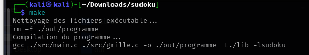
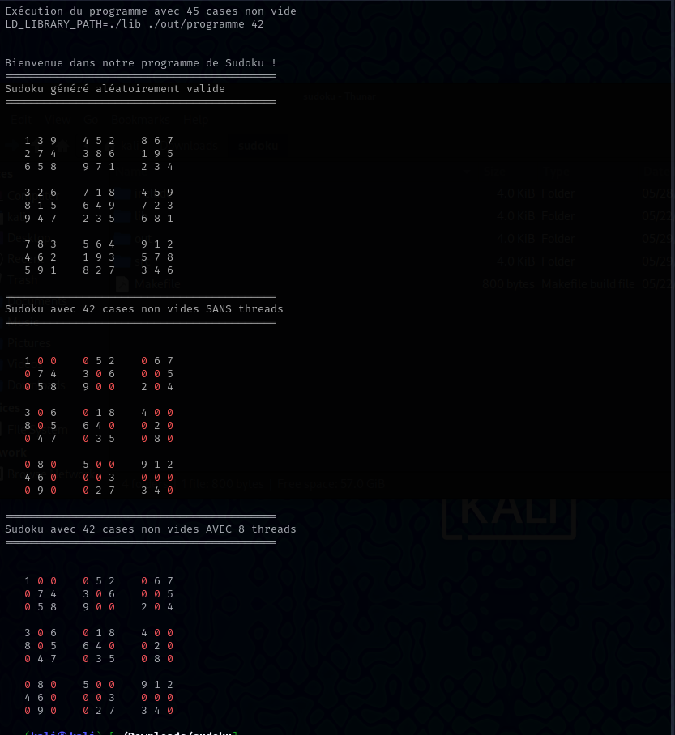

# Sudoku avec  Multithreading

Bienvenue dans le répertoire de notre programme Sudoku ! Ce projet implémente un générateur de Sudoku valide, un résolveur de Sudoku, et une fonctionnalité pour vider des cases aléatoires d'une grille en utilisant des threads pour optimiser certaines opérations.

---

## Fonctionnalités Principales

1. **Génération d'un Sudoku valide**  
   Crée une grille de Sudoku aléatoire respectant les règles classiques.

2. **Résolution avec multithreading**  
   Utilise des threads pour tester plusieurs hypothèses en parallèle, améliorant les performances pour certains cas complexes.

3. **Grilles avec cases vides**  
   Génère des grilles avec un nombre spécifique de cases non vides, tout en garantissant l'unicité de la solution.

---

## Prérequis

Avant de commencer, assurez-vous d'avoir les outils suivants installés :

- Un compilateur prenant en charge le standard C11 (comme `gcc`).
- `make` pour la compilation.
- Un système compatible POSIX (Linux, macOS, etc.).

---

## Installation

1. Clonez ce dépôt :
   ```bash
   git clone https://github.com/<votre-utilisateur>/<votre-repo>.git
   cd <votre-repo>
   ```

2. Compilez le projet :
   ```bash
   make
   ```

---

## Utilisation

1. **Exécution du programme**
   
   Lancez l'exécutable avec un argument indiquant le nombre de cases non vides (entre 40 et 50) :
   ```bash
   ./sudoku_solver <nombre-de-cases-non-vides>
   ```
   Exemple :
   ```bash
   ./sudoku_solver 45
   ```

2. **Fonctionnalités principales affichées**
   - Le programme génère d'abord un Sudoku complet valide.
   - Il le modifie ensuite pour inclure un nombre spécifique de cases non vides.
   - Une version de résolution avec threads est affichée.

---

## Détails Techniques

### Structures principales
- `arg_t` : Contient les informations passées à chaque thread, notamment l'indice à tester, la ligne, et la colonne.

### Synchronisation
- Les threads utilisent un mutex pour garantir une mise à jour sécurisée de la variable globale `solution_trouvee`.

### Threads
- La fonction `essaiResoudreAvecThread` est appelée par chaque thread pour tester si une valeur est valide à une position donnée.

---
## Images



## Fichiers

- `sudoku_solver.c` : Le fichier principal contenant la logique du programme.
- `libsudoku.h` et `grille.h` : Fichiers d'en-têtes contenant les fonctions utilitaires pour la génération et la gestion des grilles de Sudoku.
- `Makefile` : Automatisation de la compilation.


## Contributeurs
- **AIDEL Massinissa** 
